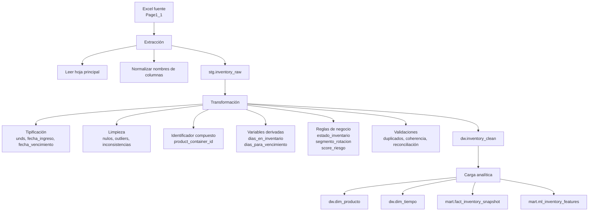
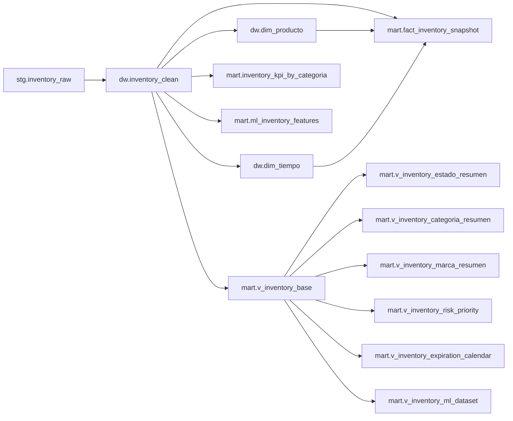

# Diagramas Mermaid

## ETL

```mermaid
flowchart TD
    A["Excel fuente<br/>Page1_1"] --> B["Extracción"]
    B --> B1["Leer hoja principal"]
    B --> B2["Normalizar nombres de columnas"]
    B --> C["stg.inventory_raw"]

    C --> D["Transformación"]
    D --> D1["Tipificación<br/>unds, fecha_ingreso, fecha_vencimiento"]
    D --> D2["Limpieza<br/>nulos, outliers, inconsistencias"]
    D --> D3["Identificador compuesto<br/>product_container_id"]
    D --> D4["Variables derivadas<br/>dias_en_inventario<br/>dias_para_vencimiento"]
    D --> D5["Reglas de negocio<br/>estado_inventario<br/>segmento_rotacion<br/>score_riesgo"]
    D --> D6["Validaciones<br/>duplicados, coherencia, reconciliación"]

    D --> E["dw.inventory_clean"]

    E --> F["Carga analítica"]
    F --> F1["dw.dim_producto"]
    F --> F2["dw.dim_tiempo"]
    F --> F3["mart.fact_inventory_snapshot"]
    F --> F4["mart.ml_inventory_features"]
```

## Modelo de Datos

```mermaid
flowchart LR
    A["stg.inventory_raw"] --> B["dw.inventory_clean"]

    B --> C["dw.dim_producto"]
    B --> D["dw.dim_tiempo"]
    B --> E["mart.fact_inventory_snapshot"]
    B --> F["mart.inventory_kpi_by_categoria"]
    B --> G["mart.ml_inventory_features"]

    C --> E
    D --> E

    B --> H["mart.v_inventory_base"]
    H --> I["mart.v_inventory_estado_resumen"]
    H --> J["mart.v_inventory_categoria_resumen"]
    H --> K["mart.v_inventory_marca_resumen"]
    H --> L["mart.v_inventory_risk_priority"]
    H --> M["mart.v_inventory_expiration_calendar"]
    H --> N["mart.v_inventory_ml_dataset"]
```

## Dashboard por Páginas

```mermaid
flowchart TD
    A["Dashboard Inventarios 360"] --> P1["Página 1<br/>Resumen Ejecutivo"]
    A --> P2["Página 2<br/>Riesgo por Categoría"]
    A --> P3["Página 3<br/>Riesgo por Marca"]
    A --> P4["Página 4<br/>Priorización Operativa"]
    A --> P5["Página 5<br/>Calendario de Vencimientos"]
    A --> P6["Página 6<br/>Analítica / ML"]

    P1 --> V1["KPIs + estado general"]
    P1 --> S1["Fuente<br/>v_inventory_estado_resumen"]

    P2 --> V2["Barras, heatmap, scatter"]
    P2 --> S2["Fuente<br/>v_inventory_categoria_resumen"]

    P3 --> V3["Rankings y comparativos por marca"]
    P3 --> S3["Fuente<br/>v_inventory_marca_resumen"]

    P4 --> V4["Tabla priorizada + filtros"]
    P4 --> S4["Fuente<br/>v_inventory_risk_priority"]

    P5 --> V5["Matriz por mes/año de vencimiento"]
    P5 --> S5["Fuente<br/>v_inventory_expiration_calendar"]

    P6 --> V6["Distribución de riesgo, importancia, evaluación"]
    P6 --> S6["Fuente<br/>v_inventory_ml_dataset"]
```
